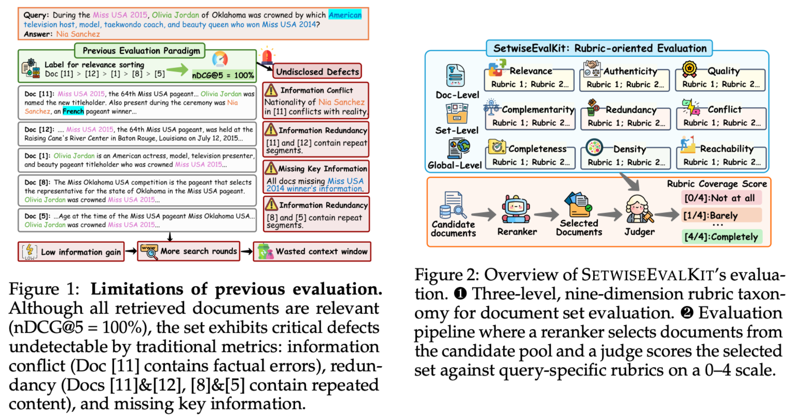
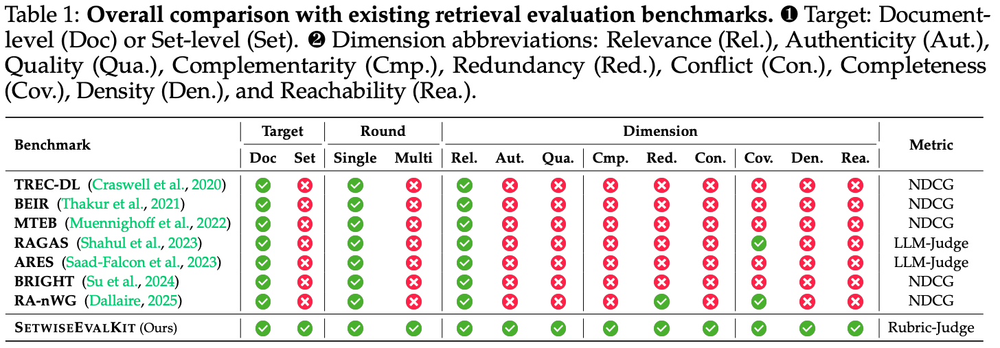
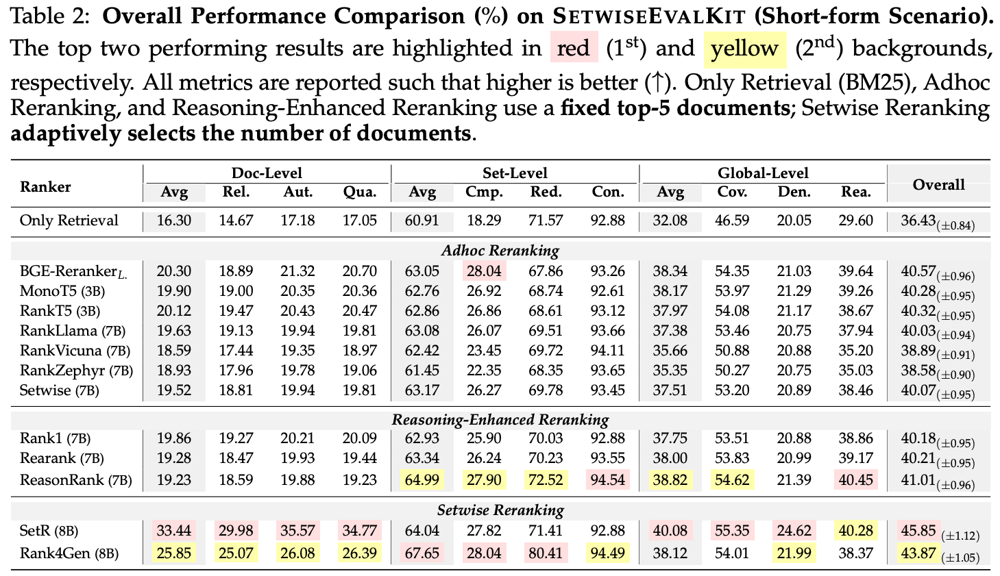
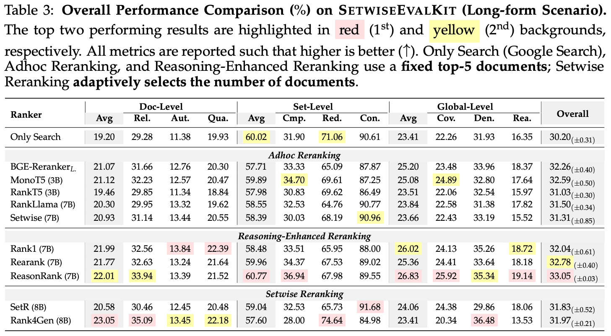
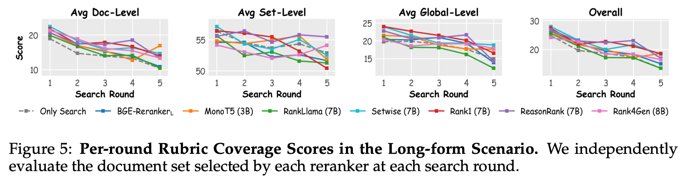
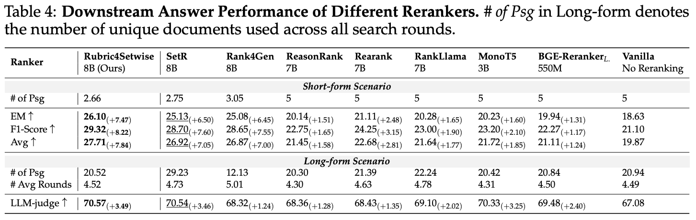

<h1 align="center"> <a href="https://arxiv.org/------">Beyond Relevance-Centric Retrieval: Rubric-Oriented Document Set Selection and Ranking</a></h1>
<h5 align="center">

[]() [](https://huggingface.co/datasets/kailinjiang/SetwiseEvalKit)  [](https://github.com/Rubric4Setwise/Rubric4Setwise)  [](https://rubric4setwise.github.io/) 

</h5>


## Table of Contents


- [Table of Contents](#table-of-contents)
- [💡 Motivation](#motivation)
- [📊 Main Results](#main-results)
- [🛠️ Requirements and Installation](#️requirements-and-installation)
- [🤖 Evaluation](#evaluation)
- [🤝 Acknowledgments](#-acknowledgments)
- [📝 Citation](#-citation)


## 💡 Motivation

<p align="center">
  
</p>

<p align="center">
  
</p>

## 📊 Main Results

<p align="center">
  
</p>

<p align="center">
  
</p>

<p align="center">
  
</p>

<p align="center">
  
</p>


## 🛠️Requirements and Installation

```text
conda env create -f rubric4setwise.yml
If there are any issues, you can refer to https://github.com/DataScienceUIBK/rankify
```
or 

```text
conda create -n rubric4setwise python=3.10 -y
cd env
pip install -r rubric4setwise.txt
```


## 🤖 Evaluation

The pipeline is driven by `run.sh`. All rerankers below share the same
three-stage flow: **rank → merge shards → generate → summarize**. Edit the
`RERANKERS` array in `run.sh` to enable/disable methods.

**Run all rerankers end-to-end**
```shell
bash run.sh
```

**Run a single reranker (rank + generate + eval)**
```shell
CUDA_VISIBLE_DEVICES=0,1,2,3 python run_pipeline.py rank \
    --reranker <reranker_id> --gpu 0,1,2,3 \
    --input /path/to/SetwiseEvalKit_short.jsonl --output-dir /path/to/output --top-k 5
```

Replace `<reranker_id>` with any of:

| Group | `<reranker_id>` |
|---|---|
| Only Retrieval | `bm25-baseline` |
| Encoder / seq2seq | `bge-reranker-large`, `monot5`, `rankt5` |
| LLM rerankers (7B) | `rankllama`, `rankvicuna`, `rankzephyr`, `setwise-sft-7b` |
| Reasoning rerankers (7B) | `rank1-7b`, `rearank-7b`, `reasonrank-7b` |
| Set-selection (8B) | `setr`, `rank4gen` |
| **Ours** | `rubric4setwise` (requires `hybrid_rubrics` in the input JSONL) |


**Rubric4Setwise (ours)**
```shell
CUDA_VISIBLE_DEVICES=0,1,2,3 python run_pipeline.py rank \
    --reranker rubric4setwise --gpu 0,1,2,3 \
    --input /path/to/data_with_hybrid_rubrics.jsonl --output-dir /path/to/output
```

**Aggregate metrics across rerankers**
```shell
python run_pipeline.py summarize \
    --input /path/to/data.jsonl --output-dir /path/to/output \
    --rerankers bm25-baseline bge-reranker-large rubric4setwise \
    --generators Qwen/Qwen3-8B
```

**Rubric-based LLM-as-judge scoring**

For rubric-oriented set-level evaluation (Doc/Set/Global-level 9 dimensions
with Relevance gate, Conflict not-applicable, and dimension-level resume),
see [`judge_scroing/`](judge_scroing/README.md) — full details, prompt
template, and CLI usage live there.

```shell
python judge_scroing/scoring.py <input.jsonl> <output.jsonl> \
    --limit 100 --concurrency 25
```


## 🤝 Acknowledgments
We thank the following open-source projects for making this work possible:
- [Rankify](https://github.com/DataScienceUIBK/rankify)
- [Rank4Gen](https://github.com/JOHNNY-fans/Rank4Gen)
- [SetR](https://github.com/LGAI-Research/SetR)
- [ReasonRank](https://github.com/8421BCD/ReasonRank)
- [Rank1](https://github.com/orionw/rank1)
- [Rearank](https://github.com/lezhang7/Rearank)


## 📝 Citation
If you find our paper and code useful in your research, please consider giving a star ⭐ and citation 📝 :)

```bibtex
@article{jiang2026rubric4setwise,
  title = {Beyond Relevance-Centric Retrieval: Rubric-Oriented Document Set Selection and Ranking},
  author={Kailin Jiang and Lei Liu and Jian Xi and Hui Xu and Junlin Liu and Baochen Fu and Bin Li and Vichwang and Yu Lu and Haibo Shi},
  journal={arXiv preprint arXiv:2607.19747},
  year={2026}
  url = {https://arxiv.org/abs/2607.19747}
}
```


          

        
